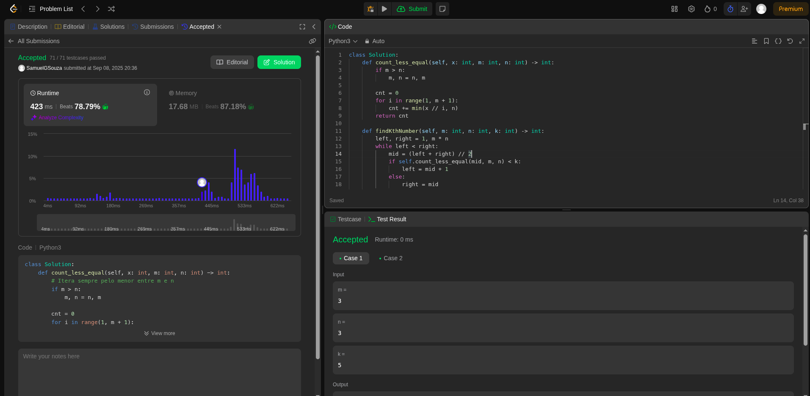
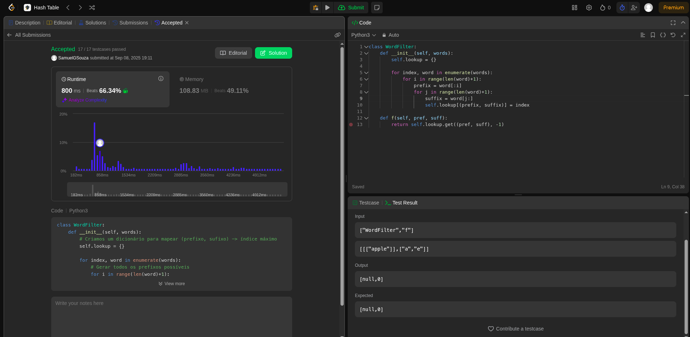
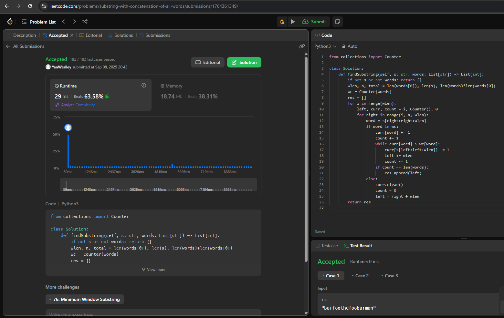
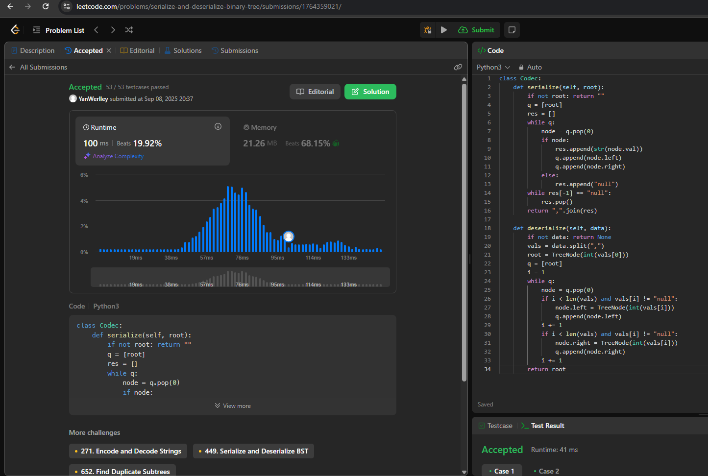

# Questões - Juíz Online

**Número da Lista**: 01 
**Conteúdo da Disciplina**: Algoritmo de Busca 

## Alunos

| Matrícula  | Aluno                               |
| ---------- | ----------------------------------- |
| 21/1030649 | Yan Werlley de Freitas Paulo |
| 21/1030881 | Samuel Gomes de Souza         |

## Apresentação

A apresentação pode ser vista [aqui]().

## Sobre

Este projeto consiste na realização de exercícios da plataforma de juiz online LeetCode. São desenvolvidos problemas Difícil e Média
complexidade sobre Algoritmo de Busca.

## Screenshots

#### Exercício 01 - (668) Kth Smallest Number in Multiplication Table

Dificuldade: Difícil  
Descrição do Problema: [Kth Smallest Number in Multiplication Table](https://leetcode.com/problems/kth-smallest-number-in-multiplication-table/description/) 
Solução: 

#### Exercício 02 - (745) Prefix and Suffix Search

Dificuldade: Difícil  
Descrição do Problema: [Prefix and Suffix Search](https://leetcode.com/problems/prefix-and-suffix-search/description/?envType=problem-list-v2&envId=hash-table)  
Solução: 

#### Exercício 03 - (30) Substring with Concatenation of All Words

Dificuldade: Difícil  
Descrição do Problema: [Substring with Concatenation of All Words](https://leetcode.com/problems/substring-with-concatenation-of-all-words/description/)  
Solução: 

#### Exercício 04 - (297) Serialize and Deserialize Binary Tree

Dificuldade: Difícil  
Descrição do Problema: [Serialize and Deserialize Binary Tree](https://leetcode.com/problems/serialize-and-deserialize-binary-tree/description/)  
Solução: 

## Conclusões

## Instalação

**Linguagem**: Python  

## Uso

Para executar os códigos, é recomendado clicar no link do problema que direciona para o LeetCode e rodar o código diretamente na plataforma.
<!--## Outros

Quaisquer outras informações sobre seu projeto podem ser descritas abaixo.

-->
